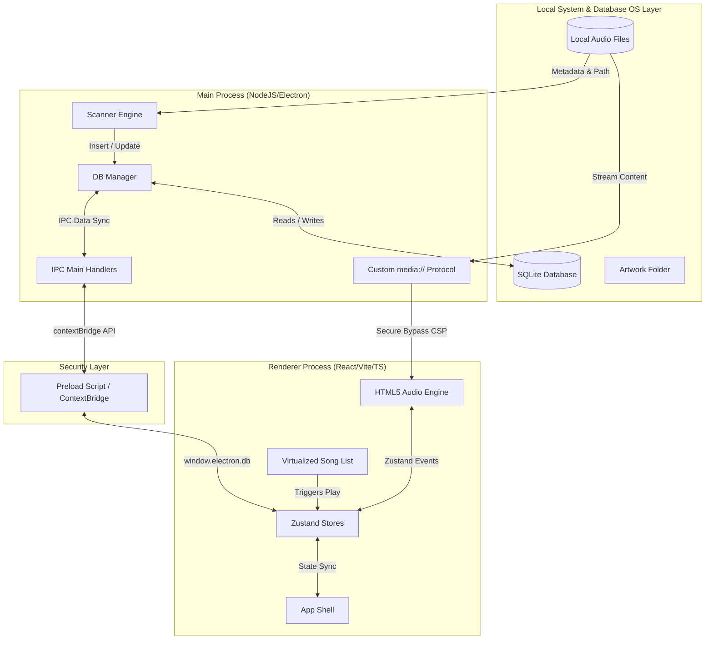

# 🎵 Pulse — Modern Desktop Music Player

[](https://github.com/rkravikr)
[](LICENSE)
[](https://github.com/rkravikr/pulse-music-player)

Pulse is a high-performance, visually stunning offline desktop music player built using **Electron**, **React**, **Vite**, **TypeScript**, and **Tailwind CSS**. It is designed with a premium glassmorphic UI, smooth micro-animations, customizable colors, and a robust offline local database engine powered by **SQLite** (`better-sqlite3`).

---

## 📌 Table of Contents
1. [Architectural Overview](#-architectural-overview)
2. [Key Features](#-key-features)
3. [User Interface & Views](#-user-interface--views)
4. [Database & Schema Design](#-database--schema-design)
5. [Settings & Control Panel](#-settings--control-panel)
6. [Performance & Security Implementation](#-performance--security-implementation)
7. [Development Guide](#-development-guide)
8. [Build & Packaging](#-build--packaging)
9. [License](#-license)
10. [Credits & Contributors](#-credits--contributors)

---

## 🏗️ Architectural Overview

Pulse utilizes Electron's security-first multi-process architecture to separate system-level access from the visual rendering interface:



### 1. Main Process (`src/main`)
- **App Lifecycle**: Manages application startup, single-instance enforcement, and native tray window controls.
- **SQLite Database (`database.ts`)**: Direct native access via `better-sqlite3` to perform rapid reads/writes of indexing files, configurations, and playlist configurations.
- **Scanner Engine (`scanner.ts`)**: Crawls folders asynchronously, parses audio metadata (artist, title, genre, year, album, embedded artwork) using `music-metadata`, and saves album covers onto the local storage folder.
- **Custom Protocol (`media://`)**: Serves local audio and artwork resources directly to the renderer in a secure manner without opening system path access to Chromium.

### 2. Preload Script (`src/preload`)
- Establishes a strict `contextBridge` to expose a limited set of IPC endpoints (`window.electron.db`).
- Disables node integration in the renderer, sandboxing frontend views to prevent remote execution exploits.

### 3. Renderer Process (`src/renderer`)
- **Vite & React**: Builds a fast Single Page Application (SPA).
- **Zustand State Store**: Coordinates playback queues, active playing states, color/style preferences, and navigation states.
- **HTML5 Audio Engine**: Manages low-latency playback, track progression, audio volume levels, and crossfade intervals.

---

## 🚀 Key Features

### 🌟 Advanced Playing Queue with Drag-and-Drop
- The Queue Panel is structured with a slide-out glassmorphic panel overlaying the page.
- Utilizes `@dnd-kit/core` and `@dnd-kit/sortable` allowing users to click and drag to instantly re-organize upcoming tracks.
- Snappy pointer sensors and keyboard shortcuts let users modify their queue on the fly.
- Offers direct "Play Next", "Add to Queue", and "Clear Queue" shortcuts.

### ⚡ Virtualized Song Rendering
- Standard lists slow down when loading thousands of files. Pulse utilizes `@tanstack/react-virtual` to virtualize track lists.
- Dynamically creates and renders only the elements visible inside the viewport, allowing smooth scrolling over directories with **10,000+ tracks** while maintaining less than 1% CPU utilization.

### 💿 Automatic Artwork Processing
- Scans files for ID3 metadata tags.
- If embedded artwork exists, it extracts, hashes (MD5 matching to avoid duplicates), and saves the image to the local user data folder.
- Falls back to crawling directory folders for local files (e.g. `cover.jpg`, `folder.png`, `album.jpg`).
- Features elegant default dynamic gradients if no images are found.

### 🎚️ Playback & Crossfade Engine
- Allows custom crossfade timings (0 to 12 seconds) for gapless transitions.
- Restores prior state on startup (remembers last track, active queue, and slider placement).

---

## 🎨 User Interface & Views

- **Frameless Title Bar**: A custom header with window controls styled to match the dark aesthetic.
- **Sidebar**: Easy navigation tabs for **Home**, **Songs**, **Albums**, **Playlists**, **Recently Played**, and **Settings**.
- **Home Dashboard**: Offers quick insights with statistics (Total Songs, Albums, Playlists, and Liked tracks), alongside direct access to **Recently Played** cards and **Top Tracks** graphs.
- **Songs Page**: Allows users to filter files, search through titles, artists, albums, or genres, and sort alphabetically or by date added.
- **Album Detail Page**: Collates songs by album grouping, automatically loading covers and tracks in sequential order.
- **Playlist Page**: Create and manage custom folders. Each playlist profile supports customizable title headers, descriptions, and custom cover images.
- **Context Menu**: Right-click on any track to open a glassmorphism context menu to like, delete, add to queue, or route to playlists.

---

## 💾 Database & Schema Design

Pulse runs a local SQLite database file in the user's local application data directory. Here is the relational schema configuration:

```sql
CREATE TABLE IF NOT EXISTS songs (
  id TEXT PRIMARY KEY,
  title TEXT,
  artist TEXT,
  album TEXT,
  genre TEXT,
  duration INTEGER,          -- duration in seconds
  track_number INTEGER,
  file_path TEXT UNIQUE,     -- direct absolute file location
  artwork_path TEXT,         -- cached artwork file location
  play_count INTEGER DEFAULT 0,
  last_played DATETIME,
  date_added DATETIME
);

CREATE TABLE IF NOT EXISTS playlists (
  id TEXT PRIMARY KEY,
  name TEXT NOT NULL,
  description TEXT,
  cover_image TEXT,          -- path to custom cover art
  created_at DATETIME
);

CREATE TABLE IF NOT EXISTS playlist_songs (
  playlist_id TEXT,
  song_id TEXT,
  sort_order INTEGER,
  PRIMARY KEY (playlist_id, song_id),
  FOREIGN KEY (playlist_id) REFERENCES playlists(id) ON DELETE CASCADE,
  FOREIGN KEY (song_id) REFERENCES songs(id) ON DELETE CASCADE
);

CREATE TABLE IF NOT EXISTS settings (
  key TEXT PRIMARY KEY,      -- persistent key-value configuration storage
  value TEXT
);

CREATE TABLE IF NOT EXISTS recently_played (
  id TEXT PRIMARY KEY,
  song_id TEXT,
  played_at DATETIME,
  FOREIGN KEY (song_id) REFERENCES songs(id) ON DELETE CASCADE
);

CREATE TABLE IF NOT EXISTS queue (
  position INTEGER PRIMARY KEY, -- persists queue order across sessions
  song_id TEXT,
  FOREIGN KEY (song_id) REFERENCES songs(id) ON DELETE CASCADE
);

-- Performance Indexes
CREATE INDEX IF NOT EXISTS idx_songs_artist ON songs(artist);
CREATE INDEX IF NOT EXISTS idx_songs_album ON songs(album);
CREATE INDEX IF NOT EXISTS idx_playlist_songs_playlist_id ON playlist_songs(playlist_id);
CREATE INDEX IF NOT EXISTS idx_recently_played_played_at ON recently_played(played_at);
```

---

## ⚙️ Settings & Control Panel

The settings section is divided into 6 dedicated categories:

| Tab | Feature Name | Description |
| :--- | :--- | :--- |
| **🎛️ Playback** | Crossfade Duration | Sliders to configure transitions (0 to 12s, or Disabled). |
| | Session Restoration | Restores prior session queues, tracks, and slider progress. |
| **📂 Library** | Index Folders | Add or remove local folders to be crawled. |
| | Library Scanner | Manual trigger scans that index files and extract metadata. |
| | Auto Scan | Toggle auto-scanning folders on startup. |
| **🎨 Appearance**| Theme Accents | Hue picker: **Sky**, **Violet**, **Rose**, **Teal**, **Amber**, or **Emerald**. |
| | Row Density | Layout toggle between **Comfortable** and **Compact** density. |
| **🔔 Notifications**| Track Alerts | Sends a native desktop notification when a new track starts. |
| | System Tray | Toggle option to minimize Pulse to the system tray. |
| **💾 Storage** | Artwork Cache | View total size of cover art on disk. Offers a clear cache option. |
| | CSV Export | Export the library database tracks into a `.csv` sheet. |
| | Factory Reset | Instantly purges all tables, files, and configurations. |
| **ℹ️ About** | System Information | Displays the current version, application path, and SQLite database path. |

---

## 🔒 Performance & Security Implementation

### 1. Sandboxing & IPC Context Isolation
Chromium's renderer does not run node operations. By setting `nodeIntegration: false` and `contextIsolation: true`, the app prevents potential security threats. Communication between the renderer and main process is strictly restricted to IPC channels exposed via `preload.js`.

### 2. Custom Media Protocol Bypass
Loading local files directly in HTML elements using `file://` schemes triggers browser Security Violation alerts.
Pulse registers a custom `'media'` protocol on application startup:
```typescript
protocol.handle('media', (request) => { ... })
```
This serves files using a `media://` scheme, enabling:
- **Range Headers Support (HTTP 206 Partial Content)**: Crucial for seeking, buffering, and scrubbing tracks without loading the entire audio file into memory.
- **Content Security Policy (CSP) Compliance**: Allows the UI to play media securely.

### 3. RAM Optimization
- **Zustand Store**: Prevents unnecessary React re-renders.
- **SQLite Indexing**: Allows rapid indexing, querying, and filtering, using under 10MB of memory for data storage.
- **Virtualized Lists**: Prevents UI lag and excessive memory consumption when rendering thousands of items.

### 4. Single Instance Lock
Enforces single-instance locks using `app.requestSingleInstanceLock()`. Opening another window focuses the active main instance to avoid SQLite database write conflicts.

---

## 💻 Development Guide

### Prerequisites
- [Node.js](https://nodejs.org/) (v18.x or v20.x recommended)
- Git

### Installation
1. Clone the repository:
   ```bash
   git clone <your-repo-url>
   cd "Pulse - Music Player"
   ```
2. Install dependencies:
   ```bash
   npm install
   ```

### Project Run Scripts
Available commands in [`package.json`](package.json):

* **Run Dev Environment**:
  ```bash
  npm run dev
  ```
  Runs Vite (port 5173) for the React frontend, compiles TS main process files, and launches Electron concurrently.

* **Build Code**:
  ```bash
  npm run build
  ```
  Compiles main/renderer files to javascript assets.

* **Package Application**:
  ```bash
  npm run package
  ```
  Compiles code and bundles it into a standalone Windows installer using Electron Builder.

---

## 📦 Build & Packaging

Pulse is configured for easy packaging via [`electron-builder.json`](electron-builder.json).

### Setup Configuration
- Files are compressed into an executable.
- The output target is set as a **NSIS Installer**.
- Includes automatic shortcuts, install directory selection, and high-compression compression schemes.

### Distribution Installer
When you run `npm run package`, the output will be generated at:
```text
e:\Pulse - Music Player\dist\installers\Pulse Setup 1.0.0.exe
```
This is the only file required to share the app. Double-clicking it installs and runs the app on any x64 Windows 10 or 11 system.

---

## 📄 License

This project is licensed under the MIT License - see the [LICENSE](LICENSE) file for details.

---

## 👥 Credits & Contributors

- **Creator & Owner**: [Ravi Kumar Verma](https://github.com/rkravikr)
- **Technologies Used**: Electron, React, Vite, Tailwind CSS, SQLite, Zustand, Framer Motion, and `@dnd-kit`.
- **Special Thanks**: Developed as an open-source project to provide a modern, offline music playback experience on desktop platforms.
